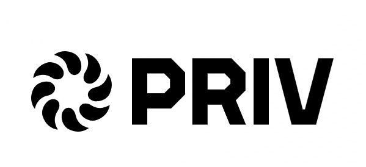

  
  
  # PRIV Helpdesk Ticketing
  ## WADS Final Project, Binus University Global Class
  

- Members: (L4AC)
  1)  Raisya Jasmine Zahira
  2)  Farrell Sevillen Arya
  3)  Emanuella Ivana Karunia
  4)  Marsya Putra 

 ## Installation Guide 
 1) Install Dependencies for both frontend and backend:
    - npm install (backend):
      >
        - express
        - mongoose
        - cos
        - dotenv
    - npm install (frontend)
      >
        - react-router-dom [handling routing in React]
        - react and react-don [UI Building]

  ## Note (when running)  
  - make sure you have MongoDB runing locally (check environment variables and set it up)
      OR MongoDB Atlas for could storage (chat raisya for access)
  - pls double check you're in correct directory or no
  - npm run dev (frontend)
  - npm start (backend) OR node server.js
    
  > Currently consisting:
- Vite + React
- CSS (not yet tailwind -- but plan 2)
- API Endpoint - POST tickets
  
